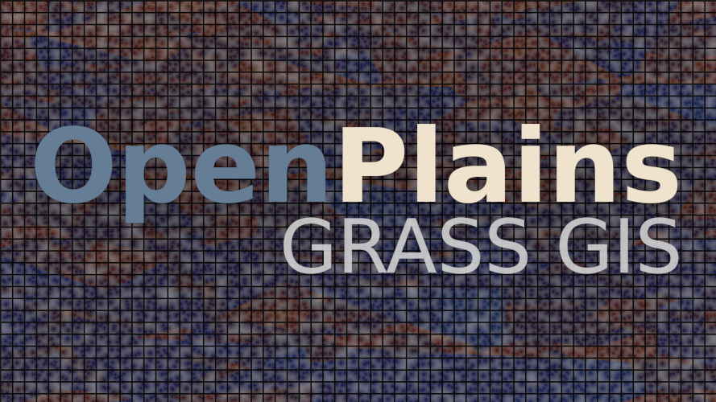
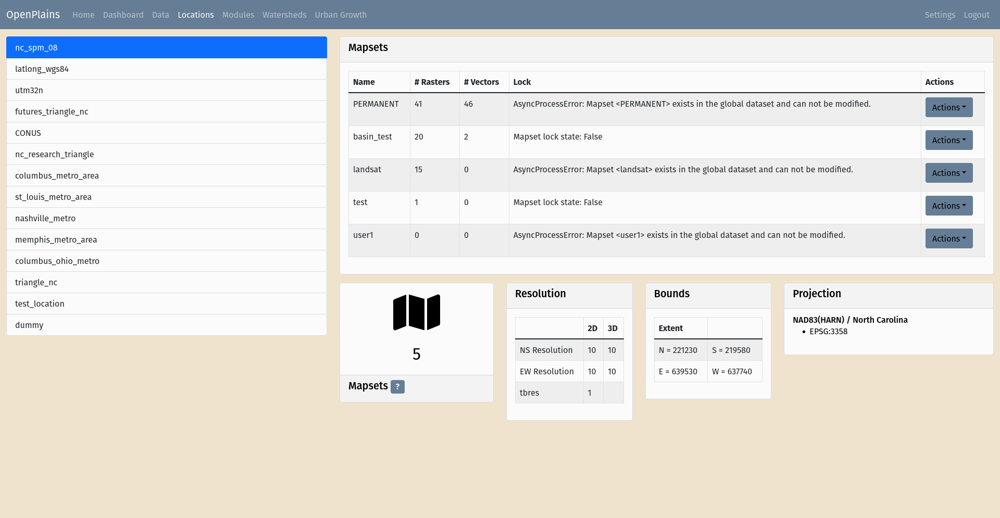
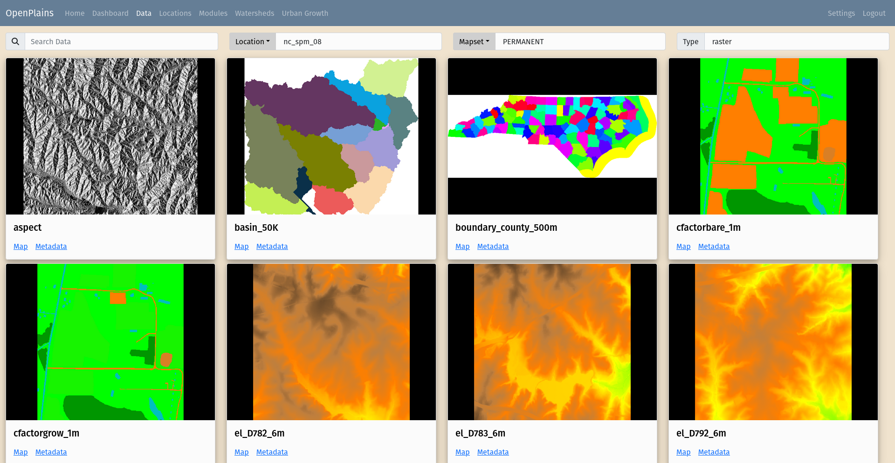
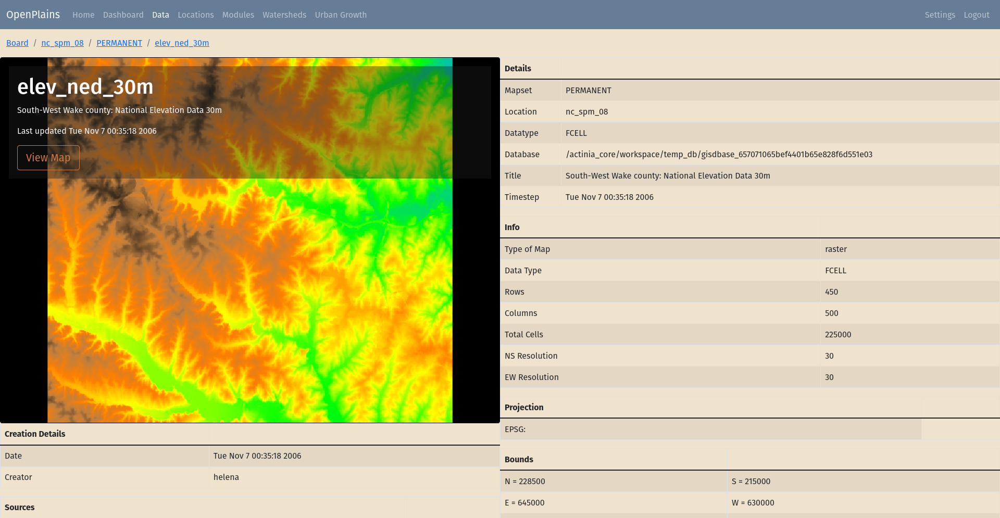
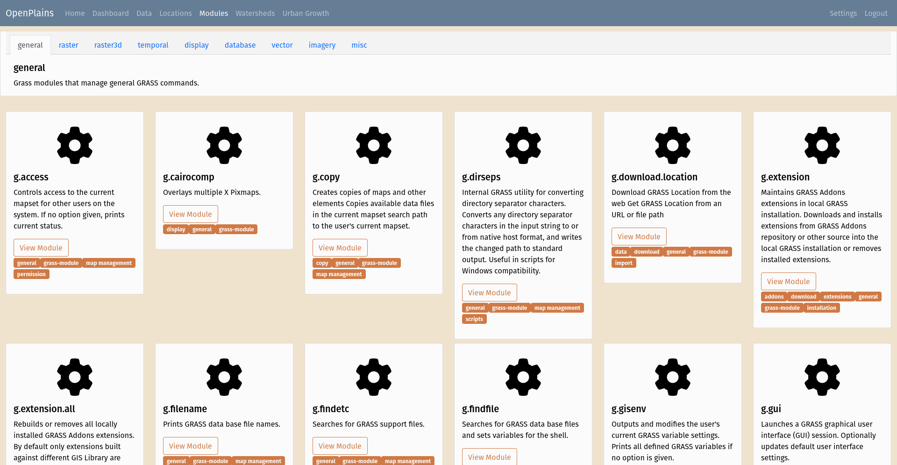
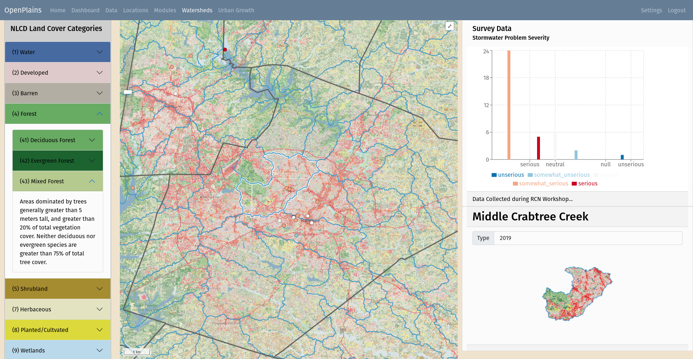
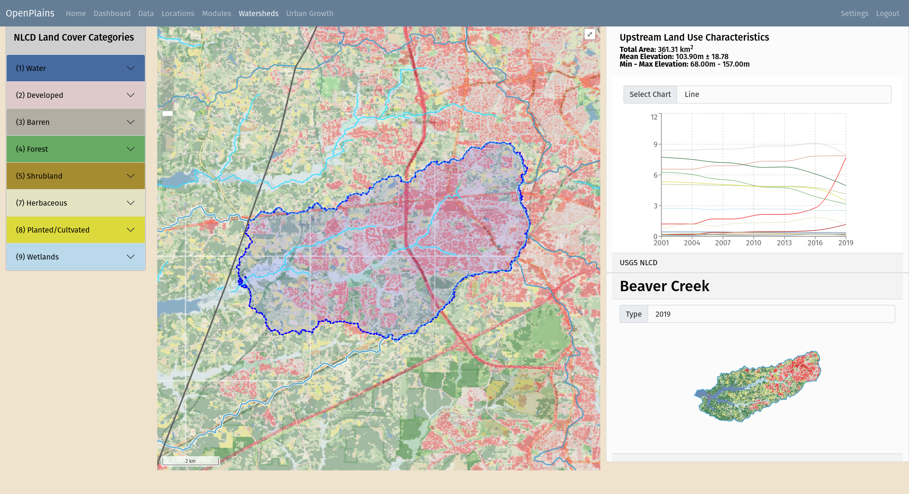
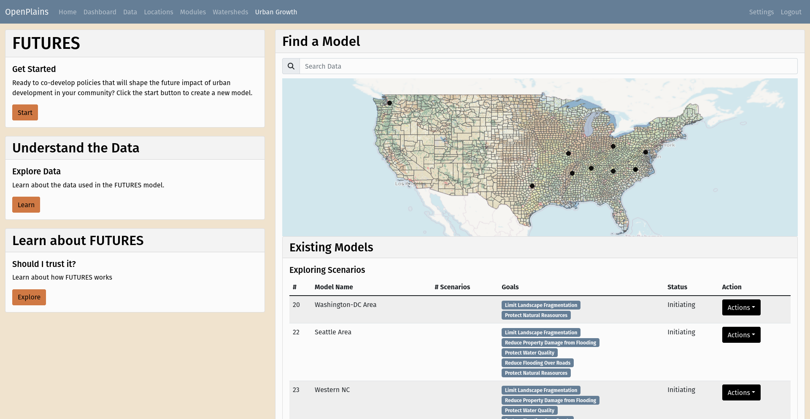

# [WIP] OpenPlains

> Currently migrating project from TomorrowNowApp repository.

**Disclaimer:** The OpenPlains project is in an experimental phase and therefore breaking changes and project restructuring will occur without notice. We recommend waiting until the first stable version is released before considering using the project in any form.

## GRASS GIS in the Browser

OpenPlains is a GRASS GIS platform that enable running GRASS GIS in the cloud using Actinia as its geospatial computational API. With OpenPlains you can use GRASS GIS in the browser or develop your own custom GRASS based web applications.

### Manage Data

#### Manage your grassdata locations and mapsets

#### Explore your data

#### Explore metadata

### Run GRASS Modules

#### Find and run GRASS modules

### Build Models

Coming Soon...

### Develop Custom Applications

#### Spatial-Temporal Watershed Modeling

Click on the map to calculate the land cover evolution of the upstream contributing area.

Wait for the results...

View the upstream contributing area and time-series data.

#### Urban Growth Forcasting

## Feedback

[Gitter](https://gitter.im/tomorrownow/community)

Provide feedback on UI our flow diagram.

[Interactive Site Map](https://lucid.app/lucidchart/116fb402-c6c9-4632-a0e9-48f9865152c6/edit?viewport_loc=-7361%2C-2960%2C14782%2C7613%2C0_0&invitationId=inv_9219e566-88ff-4d7c-b546-11fff697c298)